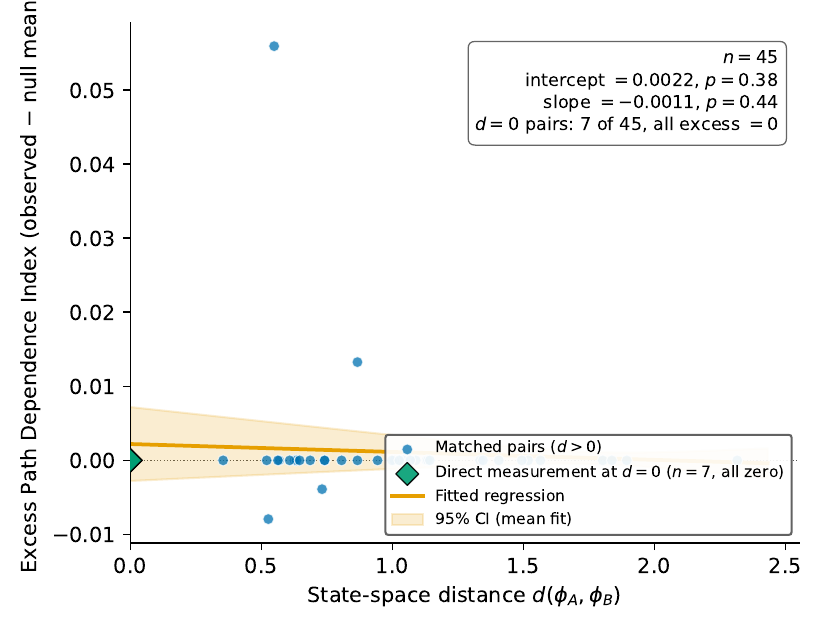
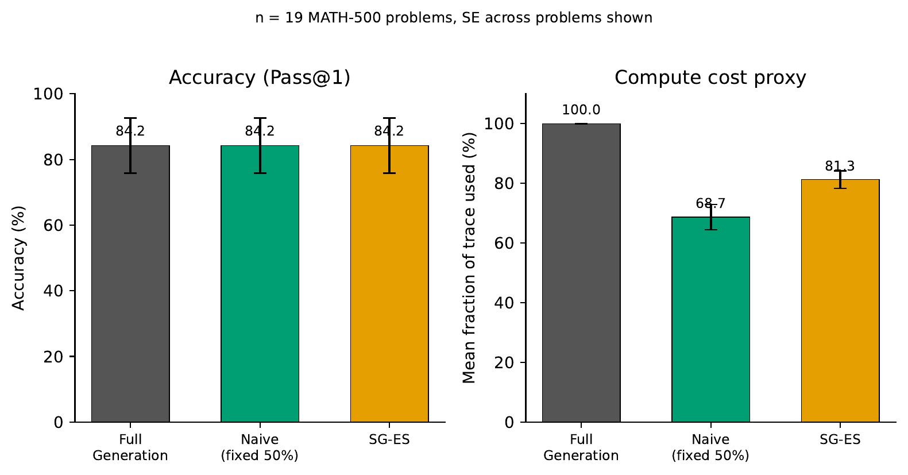

# Does a reasoning model's history matter, or just its current answer?

When a large language model works through a math problem step by step, a lot of people are building tools that try to stop it early, the moment it looks like it has already decided the answer. This saves time and money. But all of those tools quietly assume something: that the model's *current* answer, how confident it sounds, and how "sure" its next word is, tells you everything you need to know. The path the model took to get there, they assume, doesn't matter anymore.

Nobody had actually tested that assumption. This project does.

## The short version

We took a reasoning model (DeepSeek-R1-Distill-Qwen-7B), gave it math problems, and found many pairs of moments where two *different* reasoning attempts had landed on the exact same answer, with the exact same confidence, at the exact same point in their reasoning. Same answer, same confidence, different history.

Then we let each of those moments continue naturally, many times over, and checked: do they keep agreeing, or does their shared history start pulling them apart?

**Across 66 tested pairs and 17 distinct problems: mostly, but not always.** 14 of 17 problems agreed every single time, no matter which history got them there. But 3 problems didn't, and the disagreement was real, not noise, once we used the right statistical test (our first attempt at combining the results used a method that turned out to be mathematically broken on data like this, more on that below). So the honest answer is "yes, current state is usually enough, but there's a specific, identifiable minority of cases where it isn't, and you can't predict from the answer alone which case you're in."

That's a more useful and more interesting finding for anyone building an early-stopping tool than a clean "always safe" would have been: it tells you both that you're mostly fine, and roughly where the exceptions live.

## A picture is worth it

<p align="center">
  
</p>

Each dot is one tested pair from the larger of our two data batches. The x-axis is how differently two moments "felt" (confidence and uncertainty combined). The y-axis is how much their eventual answers actually diverged. The line looks flat here, which was our first read: "state distance doesn't predict divergence." That's true as far as it goes, but it isn't quite the question we actually needed answered (see below).

<p align="center">
  
</p>

We also tried building a smarter stopping rule that pays attention to confidence, not just the answer. It got the same accuracy as a much dumber rule that just stops halfway through, and used *more* compute doing it, on the typical problems this comparison was run on. Where it *should* pay off, the atypical minority below, is untested.

## The correction that changed the paper's conclusion

Early on, we combined all 66 pairs' individual test results using a standard statistical tool (Fisher's method) and got a strong "no effect" verdict. It turned out that tool was the wrong one for this data: 56 of the 66 pairs were cases where both sides agreed 100% of the time, which makes that pair's individual test mathematically return "no signal detected" no matter what, not because the model is definitely consistent there, but because there's nothing left to measure once both sides already agree completely. Averaging those in with the pairs that *did* show disagreement quietly buried the real signal.

Once we fixed that (details and code in `scripts/problem_clustered_permutation_test.py`), the picture flipped: there's a real, statistically robust effect, and it's concentrated in exactly 3 problems out of the 17 we tested. Two of them show the model deciding whether to commit to an answer or trail off unstated, depending on history. The third, more interesting one, shows the *lower-confidence* side of a matched pair scattering into different wrong answers while the higher-confidence side stays correct, something a system that only checks "does the current answer match" (as most early-stopping tools do) would never catch.

We're upfront in the paper (Objection 4 in the Limitations section) that finding this after external review flagged the original method is itself a real methodological risk worth naming, and that the next real test of this claim is an independent replication, not more digging into the same 66 pairs.

## What's actually in this repository

```
early_stop/     the core library: generation, scoring, and the statistical tests
scripts/        the scripts that actually ran the experiments on Kaggle and Modal
tests/          the test suite (pytest, no GPU required)
results/        the raw, real output from every experiment, as JSON
paper/          the paper itself: LaTeX source, and every figure as a plain PNG
docs/           the pre-registration document (what we planned to do, and every
                honest amendment we made once real data showed up)
```

Nothing here is a toy example. Every number in the paper traces back to a file in `results/`.

## Reproducing this

```bash
pip install -r requirements.txt
pytest tests/          # runs entirely on CPU, no GPU or API keys needed
```

The GPU-heavy generation scripts in `scripts/` are written for Kaggle's free T4 GPUs or Modal's paid A10 GPUs (see the comments at the top of each script for exact usage and cost). They need `deepseek-ai/DeepSeek-R1-Distill-Qwen-7B` and the `HuggingFaceH4/MATH-500` dataset, both public and free to download.

## Being honest about the limits

This result is scoped to one model and one kind of math problem. It is evidence that this specific assumption holds here, not a universal law about all reasoning models everywhere. The paper spends real space on this (see `docs/PREREGISTRATION.md` for the full, dated history of every course correction along the way, including two results we initially thought were real and later walked back after digging into the data). We would rather show that process than hide it.

## Paper

The full paper is in `paper/latex/` (compile `main.tex` with the NeurIPS style file included, or open it in Overleaf). It covers the statistics in more depth than this README, along with a discussion of *why* this sufficiency might hold and where it's likely to break.

arXiv link: coming soon.

## Citation

```
Sneh Kansagara. "On the Sufficiency of Observable State for Chain-of-Thought Early Stopping." 2026.
```

## License

MIT for the code. See `LICENSE`.
