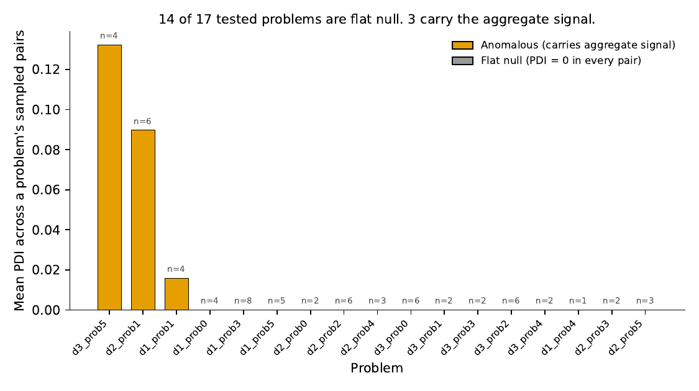
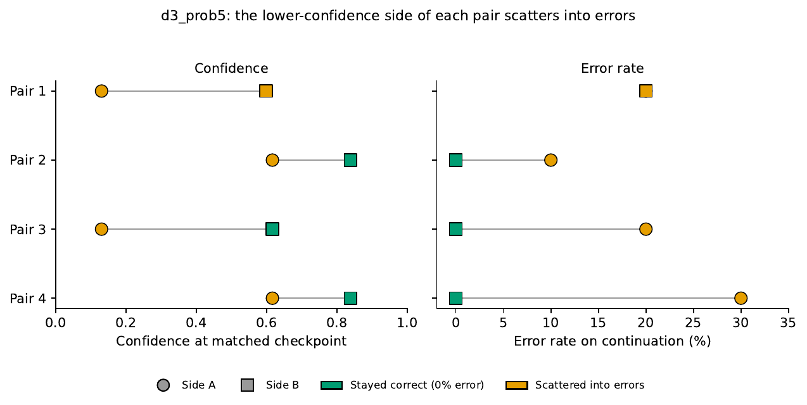

# Does checking the current answer alone tell you enough to stop early?

When a large language model works through a math problem step by step, a lot of people are building tools that try to stop it early, the moment it looks like it has already decided the answer. This saves time and money. Most of these tools check one thing: has the current answer stopped changing? A few also check confidence. We tested whether checking the answer alone is actually enough. Three problems out of seventeen looked, at different points along the way, like real exceptions. We chased each one down directly rather than let it stand, and none of the three survives scrutiny. We think that process is the most useful part of this project, and we're leading with it rather than burying it.

## The short version

We took a reasoning model (DeepSeek-R1-Distill-Qwen-7B), gave it math problems, and found many pairs of moments where two *different* reasoning attempts had landed on the exact same answer at the exact same point in their reasoning, matched on the answer alone. Same answer, different history, sometimes different confidence.

Then we let each of those moments continue naturally, many times over, and checked what happened next.

**Across 66 tested pairs and 17 distinct problems, checking the answer alone was enough everywhere we could confirm it.** 14 of 17 problems agreed every single time, no matter which history got them there. A handful of pairs also happened to match on confidence too, not by design, just because both sides had already fully committed, and every one of those showed perfect agreement as well. That part of the finding is solid and we stand behind it fully.

Three problems looked like exceptions at various points in this project. We chased every one of them down with a direct, pre-committed follow-up test rather than write them up as findings on a first read. **None of the three survives:**

- Two problems (`d1_prob1`, `d2_prob1`) showed a "decisiveness gap": one side of a matched pair would state a clean answer, the other would trail off with no boxed answer at all. This signal only showed up under one specific decoding setting (top-p = 0.95) and vanished under another (default top-p) run on the same problems, which is evidence about sampling configuration, not about history. A follow-up audit at the correct configuration found the mechanism is real, one fresh branch out of 320 was empty at the original 1500-token cutoff and closed by 3000, but nowhere near common enough to explain the original 5.8% empty rate. Most of that gap did not reproduce.
- The third (`d3_prob5`) looked like the cleanest finding in the whole dataset: the lower-confidence side of a matched pair tended to answer wrong later, a 10-30 percentage point gap. It didn't survive two checks. First, a direct follow-up test showed the gap persists even when confidence *is* matched, and reverses direction as often as not when it isn't, so confidence doesn't explain it. Second, and more decisively: the four "independent" pairs turned out to be three prefix pairings built from four prefixes, one pairing counted twice, and one single prefix resampled against itself, with no difference in history whatsoever, reproduced the entire claimed effect (0%, 10%, and 30% error across three independent branch sets). The effect is inside the noise of one prefix resampled against itself.

So the honest finding is the plain one: **observable state (the current answer, confidence, and entropy) is sufficient for early-stopping decisions on this model and this dataset. Three apparent exceptions turned up along the way, and every one of them, examined directly, turned out not to be real.** We'd rather report that, and show the three times we almost believed otherwise, than the more exciting, less true version.

## A picture is worth it

<p align="center">
  
</p>

Every bar is one of the 17 problems we tested. Fourteen of them (grey) never showed any disagreement at all, no matter how many times or how many ways we sampled them. Three (orange) are where the apparent signal lived, and where every bit of the aggregate effect size (0.0062, smaller than the average within-pair sampling noise) comes from. As the text above explains, none of the three holds up under direct follow-up.

<p align="center">
  
</p>

Each dot is one tested pair. The x-axis is how differently two moments "felt" (confidence and uncertainty combined). The y-axis is how much their eventual answers actually diverged, corrected for a statistical bias in the raw measurement (see below). The diamond points sit at true zero distance, meaning both sides matched on confidence too, not by design, just because both had already fully committed. Every single one of those diamonds shows zero divergence. That is the most direct evidence in this whole project: when the observable state is genuinely, fully matched, the future is not up for grabs.

<p align="center">
  
</p>

This is the original pattern in `d3_prob5`, the problem where confidence looked like a clean explanation, before follow-up testing found it inside the noise of a single prefix resampled against itself (see below). In 3 of these 4 original pairs, the lower-confidence side (left dot) is the one that later gave a wrong answer (right dot). We're keeping this figure because it's honest history, this is what we saw first and what motivated the follow-up test, not because we still think it's evidence of anything.

## What actually happened, told straight

Early on, we combined all 66 pairs' individual test results using a standard statistical tool (Fisher's method) and got a strong "no effect" verdict. That tool turned out to be the wrong one for this data: 56 of the 66 pairs were cases where both sides agreed 100% of the time, which makes that pair's individual test mathematically return "no signal detected" no matter what. Averaging those in with the pairs that did show disagreement quietly buried a small apparent signal, concentrated in exactly 3 problems out of 17, once combining was fixed.

We then designed and ran direct follow-up tests on both proposed mechanisms behind that signal, rather than stop at the first read, and both follow-ups killed the mechanism they were testing. For `d3_prob5`, a fresh-data follow-up showed divergence persisting even when confidence *was* matched, and reversing direction as often as not when it wasn't, so confidence doesn't explain it, and checking each pair's underlying prefix showed the "four independent pairs" were really three prefix pairings from four prefixes, with one prefix's own resampled branch sets alone spanning the entire claimed effect. For `d1_prob1`/`d2_prob1`, a targeted censoring audit (rerun after we caught our own implementation bug: the original version accidentally tested the wrong decoding configuration) found the mechanism is real but rare at the correct configuration: 1 of 320 fresh branches was empty at the original cutoff and closed with more tokens, versus 5.8% empty in the original sample. The full, dated sequence of every reading we tried and walked back, including this one, is in the paper's Appendix A ("Deviations and Corrections"), with `docs/PREREGISTRATION.md` as the original plan it deviates from.

## What's actually in this repository

```
early_stop/     the core library: generation, scoring, and the statistical tests
scripts/        the scripts that ran the experiments (Kaggle, Modal) and the
                analysis that turns raw results into every number in the paper
tests/          the test suite (pytest, no GPU required)
results/        the raw, real output from every experiment, as JSON
paper/          the paper itself: LaTeX source, and every figure as a plain PNG
docs/           the pre-registration document (what we planned to do, and every
                honest amendment we made once real data showed up)
```

Nothing here is a toy example. Every number in the paper traces back to a file in `results/`, and `scripts/final_analysis.py` reproduces all of them in one run.

## Reproducing this

```bash
pip install -r requirements.txt
pytest tests/                        # runs entirely on CPU, no GPU or API keys needed
python scripts/audit_smoke_test.py   # same, a free end-to-end check of the audit pipeline
python scripts/final_analysis.py     # reproduces every statistic in the paper from results/
```

The GPU-heavy generation scripts in `scripts/` are written for Kaggle's free T4 GPUs or Modal's paid A10 GPUs (see the comments at the top of each script for exact usage and cost). They need `deepseek-ai/DeepSeek-R1-Distill-Qwen-7B` and the `HuggingFaceH4/MATH-500` dataset, both public and free to download.

## Being honest about the limits

This result is scoped to one model and one kind of math problem. It is evidence that this specific finding holds here, not a universal law about all reasoning models everywhere. The paper spends real space on this, including a whole section on why this model being *distilled* (trained to imitate another model's outputs, not trained directly) might be exactly why most checkpoints turned out sufficient in the first place, and what that predicts about non-distilled models. See the paper's Appendix A for the full, dated history of every course correction along the way, including three separate readings of this data that we later walked back once we tested them directly, and `docs/PREREGISTRATION.md` for the original pre-registered plan. We would rather show that process than hide it.

## Paper

The full paper is in `paper/latex/` (compile `main.tex` with the NeurIPS style file included, or open it in Overleaf). It covers the statistics in more depth than this README, states plainly which findings are load-bearing and which are open questions, and includes a section on why this sufficiency might hold and where it's likely to break.

arXiv link: coming soon.

## Citation

```
Sneh Kansagara. "On the Sufficiency of Observable State for Chain-of-Thought Early Stopping." 2026.
```

## License

MIT for the code. See `LICENSE`.
